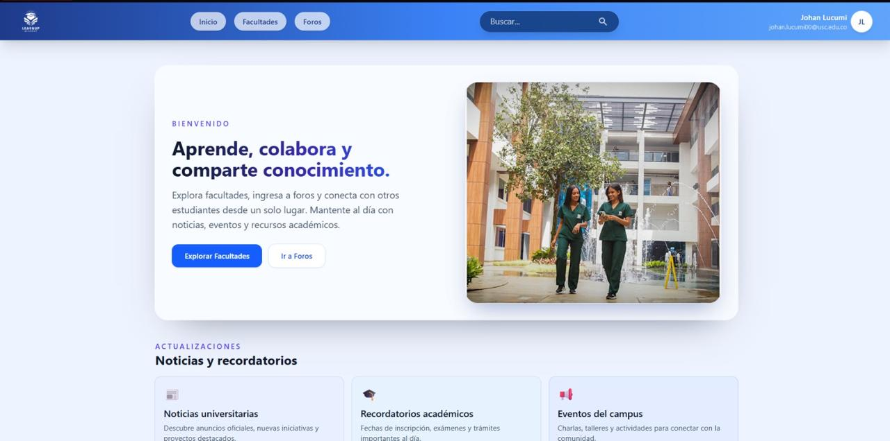

# 📚 LearnUp

LearnUp es una aplicación web de aprendizaje interactivo que permite la comunicación en tiempo real entre usuarios, integrando funcionalidades modernas como chat en vivo, manejo de datos persistentes y arquitectura fullstack.

---

## 📋 Descripción

El sistema está dividido en dos partes principales:

- **`backend/`** → API REST en Node.js + Express  
  Maneja la lógica de negocio, comunicación en tiempo real mediante WebSockets e integración con Supabase (PostgreSQL).

- **`frontend/`** → Interfaz en React  
  Permite la interacción de los usuarios con el sistema de aprendizaje en tiempo real.

---

## 🚀 Características Principales

### Comunicación en Tiempo Real
- Interacción en vivo entre usuarios mediante WebSockets  
- Manejo de eventos en tiempo real  
- Actualización dinámica de información sin recargar la página  

### Gestión de Datos
- Persistencia de datos usando PostgreSQL (Supabase)
- Uso de MongoDB para datos no relacionales  
- Manejo estructurado de información desde el backend  
- Integración con servicios backend-as-a-service  

### Arquitectura Fullstack
- API REST construida con Express  
- Separación clara entre frontend y backend  
- Flujo de datos cliente-servidor  

---

## 🛠️ Tecnologías

### Backend
- **Node.js** - Entorno de ejecución  
- **Express** - Framework backend  
- **WebSockets** - Comunicación en tiempo real  
- **Supabase** - Backend as a Service  
- **PostgreSQL** - Base de datos
- - **MongoDB** - Base de datos NoSQL  

### Frontend
- **React** - Biblioteca de UI  
- **JavaScript / TypeScript** - Lenguaje de programación  

---

## 📁 Estructura del Proyecto

```
LearnUp/
│
├── backend/        # Servidor Node.js + Express
├── frontend/       # Aplicación React
├── assets/         # Imágenes del proyecto
└── README.md
```

---

## 📦 Requisitos

- Node.js  
- npm  
- Cuenta en Supabase  

---

## 🔧 Instalación

### 1. Clonar el repositorio

```bash
git clone https://github.com/iamjohitan/LearnUp.git
cd LearnUp
```

---

### 2. Instalar dependencias

Backend:

```bash
cd backend
npm install
```

Frontend:

```bash
cd frontend
npm install
```

---

### 3. Configurar variables de entorno

Crear un archivo `.env` en la carpeta `backend/`:

```env
PORT=3000
SUPABASE_URL=tu_url_de_supabase
SUPABASE_KEY=tu_api_key
DATABASE_URL=tu_url_postgres
```

---

## 🚦 Ejecución

### Ejecutar backend

```bash
cd backend
npm run dev
```

### Ejecutar frontend

```bash
cd frontend
npm start
```

---

## 📷 Capturas




---

## 📡 Arquitectura

El sistema sigue una arquitectura cliente-servidor:

- El frontend en React consume la API REST  
- El backend en Express maneja la lógica del sistema  
- WebSockets permiten comunicación en tiempo real  
- Supabase gestiona la base de datos PostgreSQL
- MongoDB gestiona datos no estructurados y dinámicos 

---

## 📌 Estado del proyecto

🚧 En desarrollo  
Este proyecto no está completamente finalizado, pero demuestra la implementación de tecnologías modernas y funcionalidades clave.

---

## 🔐 Seguridad

- Manejo de variables de entorno  
- Separación de lógica backend/frontend  
- Validación básica de datos  

---

## 🗄️ Base de Datos (Supabase)

El proyecto implementa una arquitectura híbrida utilizando bases de datos relacionales y no relacionales:

### PostgreSQL (Supabase)
- Almacenamiento de datos estructurados  
- Manejo de relaciones entre entidades  
- Persistencia principal del sistema  

### MongoDB
- Almacenamiento de datos no estructurados  
- Manejo de información flexible (ej: eventos, logs o datos en tiempo real)  
- Soporte para funcionalidades dinámicas del sistema  


---

## 🧠 Objetivo del Proyecto

Este proyecto fue desarrollado como práctica para fortalecer habilidades en:

- Desarrollo fullstack  
- Comunicación en tiempo real  
- Integración con servicios modernos (Supabase)  
- Arquitectura de aplicaciones web  

---

## 👨‍💻 Autor

- Esteban Marta Rojas
- Johan Lucumi Palacios
- Erick Dussan Velazco
- GitHub: https://github.com/iamjohitan  

---

## 📝 Notas Adicionales

- Proyecto enfocado en aprendizaje y práctica  
- Puede contener funcionalidades en desarrollo  
- Ideal como demostración de habilidades técnicas  

---
